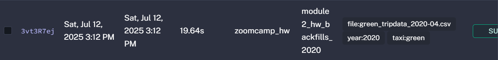
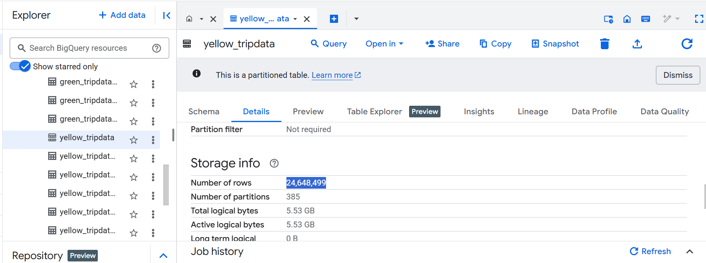
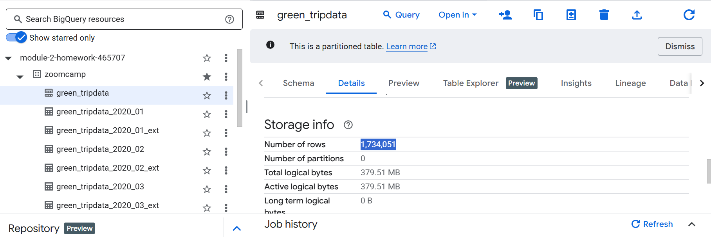
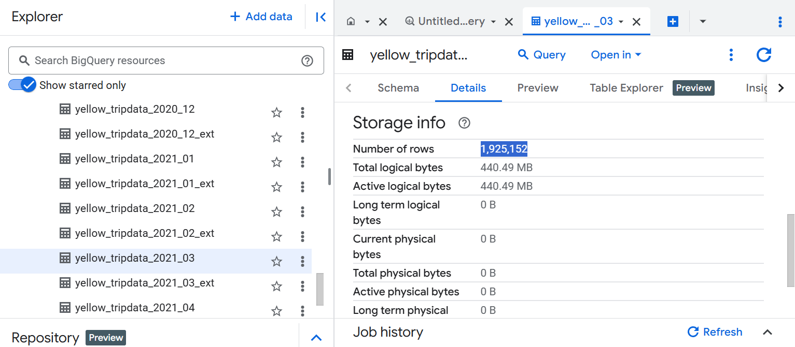

# Data-Engineering-Zoomcamp-2025-Homework

## Set up GCP

Load 2020 data using backfills: [backfill_2020.yaml](backfills_2020.yaml)

Load 2021 data using ```ForEach```: 

- [Subflow code](foreach_2021_sub.yaml)
- [Main code](foreach_2021_main.yaml)

## Question 1

> The file size is 134.5 Mib

## Question 2

> The file name is rendered as ```green_tripdata_2020-04.csv```

## Question 3

>  ```24,648,499``` records

## Question 4

-> ```24,648,499``` records

## Question 5

-> ```1,925,152``` records

## Question 6
> The answer is

• Add a ```timezone``` property set to ```America/New_York``` in the ```Schedule``` trigger configuration
