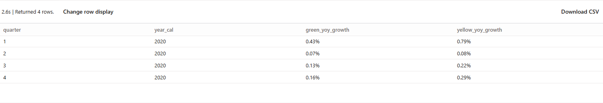
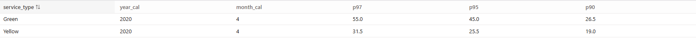
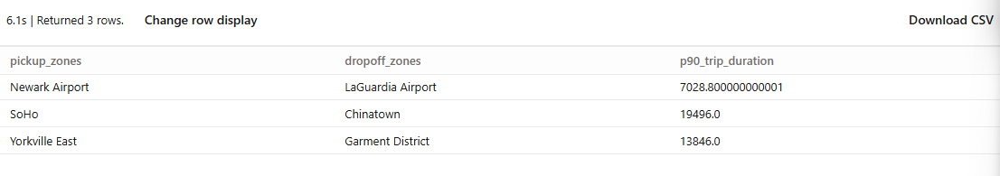

# Data-Engineering-Zoomcamp-2025-Homework

## Question 1

```sql
select * from myproject.raw_nyc_tripdata.ext_green_taxi
```

## Question 2

```Update the WHERE clause to pickup_datetime >= CURRENT_DATE - INTERVAL '{{ var("days_back", env_var("DAYS_BACK", "30")) }}' DAY```

## Question 3

```dbt run --select models/staging/+```

## Question 5

> The ```get_yoy_growth.sql``` macro
```sql
 
    SELECT {{quarter_col}}, {{year_col}}, {{service_type_col}},
    CONCAT(ROUND({{revenue_col}} / LAG({{revenue_col}}) OVER(PARTITION BY {{quarter_col}} ORDER BY {{year_col}}),2), '%') AS yoy_growth
    FROM {{table_name}}
    WHERE {{service_type_col}} = '{{service_type_val}}'

```


> The model ```fct_taxi_trips_quarterly_revenue.sql```

```sql
{{
    config(
        materialized='table'
    )
}}


WITH sub_1 AS (
    SELECT
        CASE
            WHEN EXTRACT(MONTH FROM pickup_datetime) BETWEEN 1 AND 3 THEN '1'
            WHEN EXTRACT(MONTH FROM pickup_datetime) BETWEEN 4 AND 6 THEN '2'
            WHEN EXTRACT(MONTH FROM pickup_datetime) BETWEEN 7 AND 9 THEN '3'
            ELSE '4'
        END AS quarter,
        EXTRACT(YEAR FROM pickup_datetime) AS year_cal,
        service_type,
        ROUND(SUM(total_amount), 2) AS revenue
    FROM {{ ref('fact_trips') }}
    WHERE EXTRACT(YEAR FROM pickup_datetime) IN (2019, 2020)
    GROUP BY 1,2,3
),

get_green_yoy AS (
    {{ get_yoy_growth('quarter', 'year_cal','revenue','service_type','Green','sub_1')}}
),

get_yellow_yoy AS (
    {{ get_yoy_growth('quarter', 'year_cal','revenue','service_type','Yellow','sub_1')}}
)

SELECT g.quarter, g.year_cal, g.yoy_growth AS green_yoy_growth, y.yoy_growth AS yellow_yoy_growth
FROM get_green_yoy AS g
JOIN get_yellow_yoy AS y
USING (quarter)
WHERE g.yoy_growth IS NOT NULL AND y.yoy_growth IS NOT NULL
ORDER BY g.quarter, g.year_cal
```



> The answer is ```green: {best: 2020/Q1, worst: 2020/Q2}, yellow: {best: 2020/Q1, worst: 2020/Q2}```

## Question 6

```sql
SELECT DISTINCT service_type,
EXTRACT(YEAR FROM pickup_datetime) AS year_cal,
EXTRACT(MONTH FROM pickup_datetime) AS month_cal,
PERCENTILE_CONT(fare_amount, 0.97) OVER (PARTITION BY service_type, EXTRACT(YEAR FROM pickup_datetime), EXTRACT(MONTH FROM pickup_datetime)) AS p97,
PERCENTILE_CONT(fare_amount, 0.95) OVER (PARTITION BY service_type, EXTRACT(YEAR FROM pickup_datetime), EXTRACT(MONTH FROM pickup_datetime)) AS p95,
PERCENTILE_CONT(fare_amount, 0.90) OVER (PARTITION BY service_type, EXTRACT(YEAR FROM pickup_datetime), EXTRACT(MONTH FROM pickup_datetime)) AS p90
FROM {{ ref('fact_trips') }}
WHERE fare_amount>0 AND trip_distance > 0 AND payment_type_description IN ('Cash', 'Credit card')
AND EXTRACT(YEAR FROM pickup_datetime)=2020 AND EXTRACT(MONTH FROM pickup_datetime) = 4
```



## Question 7

```sql
WITH get_trip_duration AS (
    SELECT dropoff_zones, pickup_zones, dropoff_location_id, pickup_location_id, pickup_datetime,
    TIMESTAMP_DIFF(dropoff_datetime, pickup_datetime, SECOND) AS trip_duration,
    PERCENTILE_CONT(TIMESTAMP_DIFF(dropoff_datetime, pickup_datetime, SECOND), 0.90) OVER(PARTITION BY year, month, pickup_location_id, dropoff_location_id) AS p90_trip_duration
    FROM {{ ref('dim_fhv_trips') }}
    JOIN {{ ref('dim_year') }}
    ON EXTRACT(YEAR FROM pickup_datetime) = dim_year.year
    JOIN {{ ref('dim_month') }}
    ON EXTRACT(MONTH FROM pickup_datetime) = dim_month.month
    WHERE EXTRACT(YEAR FROM pickup_datetime) = 2019 AND EXTRACT(MONTH FROM pickup_datetime) = 11
    AND pickup_zones IN ('Newark Airport', 'SoHo', 'Yorkville East')
),
get_ranking AS (
    SELECT pickup_zones, dropoff_zones, p90_trip_duration,
    DENSE_RANK() OVER(PARTITION BY pickup_zones ORDER BY p90_trip_duration DESC) AS dr
    FROM get_trip_duration

)

SELECT DISTINCT pickup_zones, dropoff_zones, p90_trip_duration
FROM get_ranking
WHERE dr=2
ORDER BY pickup_zones
```




